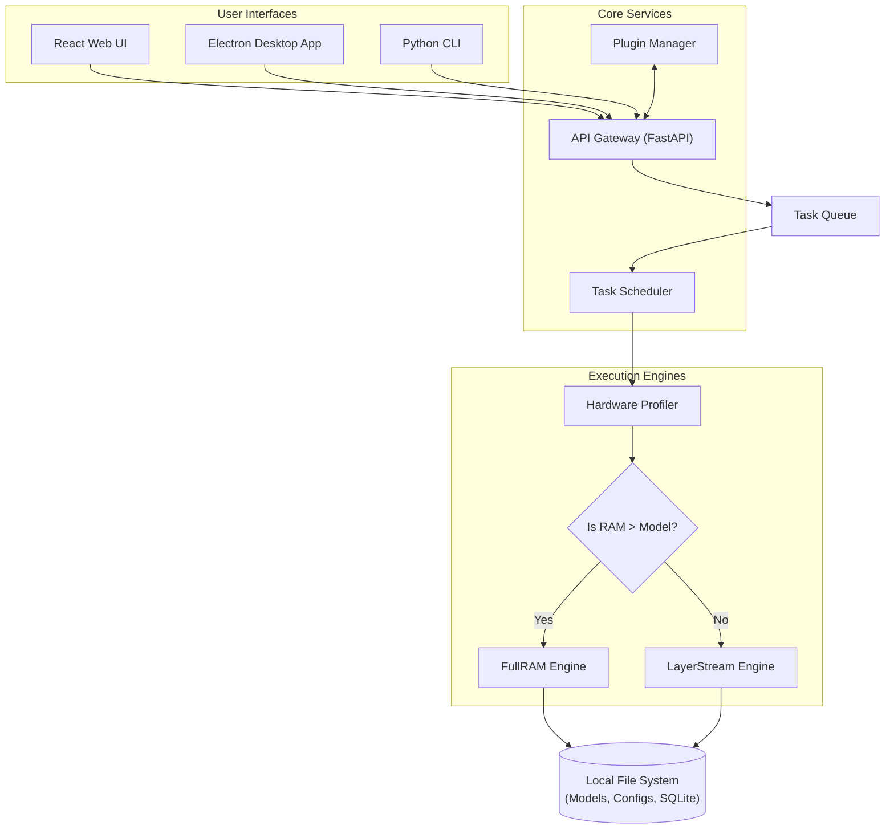

# Product Requirements Document (PRD)

---
## 1. Executive Summary
**SovereignAI Edge** is a ==fully portable==, ==100% offline== Artificial Intelligence platform that empowers users to run large language models (LLMs) locally on consumer-grade hardware or directly from external drives (USB/SSD). It eliminates the need for cloud dependency, guaranteeing utmost ==data privacy==, security, and accessibility in ==air-gapped environments==.

## 2. Target Audience & Use Cases
- **Privacy-Conscious Individuals:** Users who do not want their prompts, data, or personal information sent to corporate cloud servers.
- **Enterprise & Defense (Air-gapped Environments):** Organizations dealing with highly classified information where internet connectivity is physically severed.
- **Researchers & Data Scientists:** Professionals requiring localized AI execution for testing and internal tooling without API costs.
- **Digital Nomads & Remote Workers:** Users in areas with poor or zero internet connectivity.

## 3. Comprehensive Feature List
### 3.1. Zero-Internet Operations
- **Fully Local Execution:** Everything, including the frontend UI, backend API, and inference engine, runs locally over `localhost`.
- **Pre-packaged Dependencies:** The installation payload includes all runtime requirements (Python binaries, Node.js packages) ensuring no `npm install` or `pip install` is needed at runtime.

### 3.2. Dual Execution Engines
- **==FullRAM Engine==:** For systems with high RAM/VRAM. Loads the entire model checkpoint into active memory for maximum tokens-per-second (t/s) speed.
- **==LayerStream Engine==:** A proprietary fallback engine for extremely low-memory systems. Iteratively loads and unloads individual neural network layers from NVMe/SSD to RAM, enabling 3-8B Q4 models on 8GB RAM (measured: 0.40 tok/s, 2.3GB peak RSS). Larger models run but slowly.

### 3.3. Cross-Platform & Portability
- **USB-Bootable Execution:** Can run entirely from a portable Flash Drive or External SSD without leaving registry keys or configuration files on the host OS.
- **Multi-OS Support:** Compatible with Windows, macOS (M-series & Intel), and Linux distributions.

### 3.4. Interfaces
- **Desktop Application:** A native-feeling [[Electron]] .js application for seamless daily usage.
- **Web UI:** A modern [[React]] .js interface accessible via browser on the local network (if exposed).
- **CLI (Command Line Interface):** A terminal-based interactive shell for power users, scripting, and headless server environments.

### 3.5. Extensibility
- **==Plugin System==:** Allows the injection of custom Python scripts to extend functionality (e.g., local RAG over documents, custom system prompts, localized web search simulation based on local archives).
- **Model Agnosticism:** Supports the ==GGUF== model format natively, allowing users to drop in variants of Llama, Mistral, Gemma, etc.

## 4. Product System Context Visual

## 5. Security & Constraints
- **Data Retention:** Chat histories and configurations are saved locally via [[SQLite]] or flat JSON files.
- **Telemetry:** Strictly no telemetry, crash reporting sent to remote servers, or background internet pings.

## See Also
- [[TRD]] — Technical requirements and stack details
- [[Technical Architecture]] — System layers and component interactions
- [[Engines Overview]] — Deep-dive into FullRAM and LayerStream engines