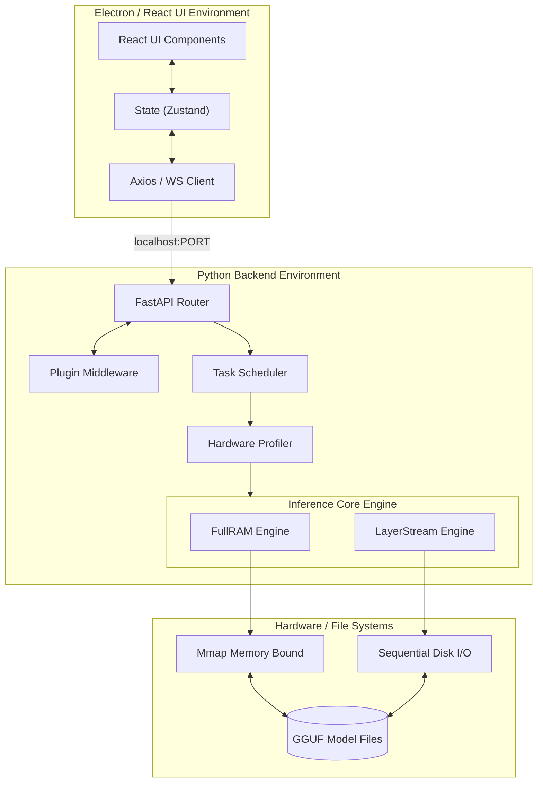

# Technical Architecture

## 1. High-Level Architecture Overview
The architecture is designed as a monolithic local service composed of decoupled micro-layers. It uses a ==Client-Server model== entirely contained within the host machine (`127.0.0.1`), where the [[Electron]]/[[React]] interface acts as the client, and the bundled Python server acts as the backend API.

## 2. Core Architectural Components

### 2.1 The Application Launcher (`launch.bat` / `launch.sh`)
Serves as the bootstrap mechanism. It validates the environment, maps relative paths from the current execution directory (crucial for USB portability), and simultaneously forks processes for both the backend [[FastAPI]] server and the frontend Electron process.

### 2.2 The Backend Gateway (FastAPI)
- **Router:** Exposes endpoints like `GET /models`, `POST /chat`, `WS /stream`.
- **Controller:** Validates payloads, handles plugin middleware events (e.g., pre-processing a prompt to inject system contexts).
- **Service Layer:** Connects to the Inference Core.

### 2.3 Inference Core & Engine Selectors
This is the heart of SovereignAI Edge.
- **==Hardware Profiler==:** Examines `psutil` and OS-level APIs to check available RAM and VRAM.
- **==FullRAM Allocation==:** If `Model_Size * 1.2 < Available_RAM`, the model is mapped directly into memory via `mmap`.
- **==LayerStream Allocation==:** If memory is insufficient, the system splits the [[GGUF]] file layers. It streams a single neural network layer from disk to RAM, processes the forward pass, drops the layer, and loads the next.

### 2.4 The Plugin Architecture
Uses dynamic Python `importlib`. The backend scans the `./plugins/` directory on startup. Plugins can register hooks via decorators (e.g., `@hook('pre_prompt')`, `@hook('post_generation')`).

## 3. Detailed Architecture Visual

## See Also
- [[PRD]] — Product vision and target users
- [[TRD]] — Technical stack and system requirements
- [[Engines Overview]] — FullRAM and LayerStream engine architecture
- [[Working Flow]] — Boot sequence and session lifecycle
- [[Schedulers]] — Task queue and resource allocation