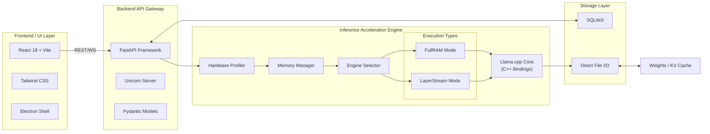

# Technical Requirements Document (TRD)

## 1. System Architecture Goals
The core objective of the **SovereignAI Edge** platform is to provide a ==zero-configuration==, dependency-free execution environment. The technical stack must support ==dynamic hardware detection==, efficient memory management, and cross-platform consistency.

## 2. Detailed Technical Stack
### 2.1 Backend / Inference Core
- **Language:** Python 3.10+ (Bundled as an embedded standalone executable via PyInstaller or similar to avoid host OS dependencies).
- **Core Frameworks:** 
  - [[FastAPI]] (for serving local REST / WebSocket API).
  - Llama.cpp Python bindings (for underlying GGML/GGUF tensor operations).
  - [[Pydantic]] (for strictly typed configurations and API models).
- **Database:** [[SQLite]]3 (Local, serverless, file-based database for chat history and plugin states).

### 2.2 Frontend / UI layer
- **Language/Framework:** Node.js 18+, [[React]] .js 18, TypeScript.
- **State Management:** [[Zustand]] or React Context for local state.
- **Styling:** [[Tailwind CSS]] for responsive and portable styling.
- **Build Tool:** [[Vite]] (for fast local bundling).

### 2.3 Desktop Wrapper
- **Framework:** [[Electron]] .js.
- **Integration:** Intercepts frontend API calls and transparently manages the lifecycle (start/stop) of the enclosed Python backend binary.

## 3. Hardware & System Requirements
### 3.1 Minimum Specifications (LayerStream Mode)
- **CPU:** 4-core processor (x86_64 or ARM64).
- **RAM:** 8 GB DDR4.
- **Storage:** NVMe SSD heavily recommended (min 10GB free space for a 7B model).
- **GPU:** Integrated Graphics.

### 3.2 Recommended Specifications (FullRAM Mode)
- **CPU:** 8-core processor+
- **RAM:** 16 GB - 32 GB DDR5.
- **Storage:** NVMe SSD.
- **GPU:** Dedicated GPU with at least 8GB VRAM (NVIDIA RTX series or Apple Silicon Unified Memory).

## 4. Portability & File System Layout
Since the application runs off external drives, absolute paths cannot be used. Operations rely on relative paths resolved dynamically at runtime.
- `./models/` - Stores `.gguf` weight files.
- `./database/` - Stores [[SQLite]] data and user configs.
- `./plugins/` - User-added Python scripts.
- `./backend/` & `./frontend/` - Application binaries.

## 5. Technology Stack Visual Diagram

## See Also
- [[PRD]] — Product vision and feature list
- [[Technical Architecture]] — System layers and deployment
- [[Engines Overview]] — FullRAM vs LayerStream deep-dive
