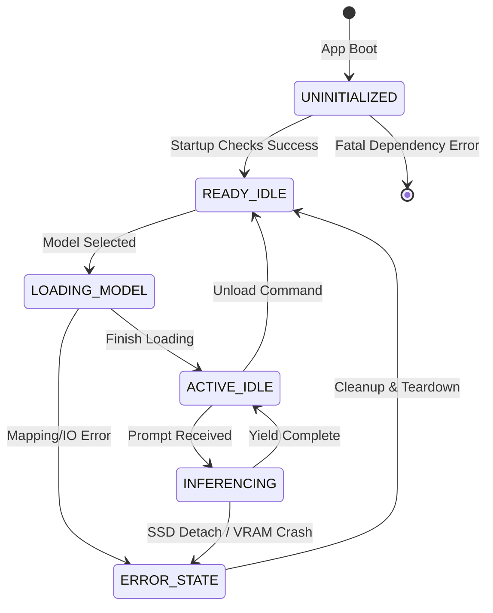

# Working Systems & State Machines

## 1. The Core Application States
SovereignAI Edge operates via ==state machines== internally to ensure consistency, prevent race conditions in offline setups with limited concurrency, and keep users informed by pushing state updates to the [[React]] frontend.

## 2. Core Operational States
- `UNINITIALIZED`: The application has launched, but environment dependencies failed. (Blocking).
- `READY_IDLE`: No model is currently loaded in memory. The system is consuming <100MB RAM. Waiting for a user config choice.
- `LOADING_MODEL`: A `.gguf` file is being mapped to RAM or preparing SSD [[LayerStream]] buffers. Inference locked.
- `ACTIVE_IDLE`: A model is loaded into RAM. Ready for instant inference. Consuming heavy RAM.
- `INFERENCING`: The `cpp` engine is actively spinning loops on the CPU/GPU to generate tokens. The [[Schedulers|Job Schedulers]] will queue all other tasks.
- `ERROR_STATE`: A fatal exception occurred (e.g., SSD detached mid-run). Forces a teardown of memory pointers and reverts to `READY_IDLE`.

## 3. Communication Patterns
The backend communicates its state to the frontend UI via a persistent ==SSE (Server-Sent Events)== endpoint or active polling. When traversing states:
1. React queries `/api/state` or receives an SSE emit.
2. The UI swaps visual blocks (e.g., morphing an input box into a "Loading Model... 45%" progress bar).

## 4. State Machine Visual

## See Also
- [[Working Flow]] — Boot sequence and session lifecycle
- [[Flowcharts]] — Model init and request handling flowcharts
- [[Schedulers]] — Task queue and resource allocation
