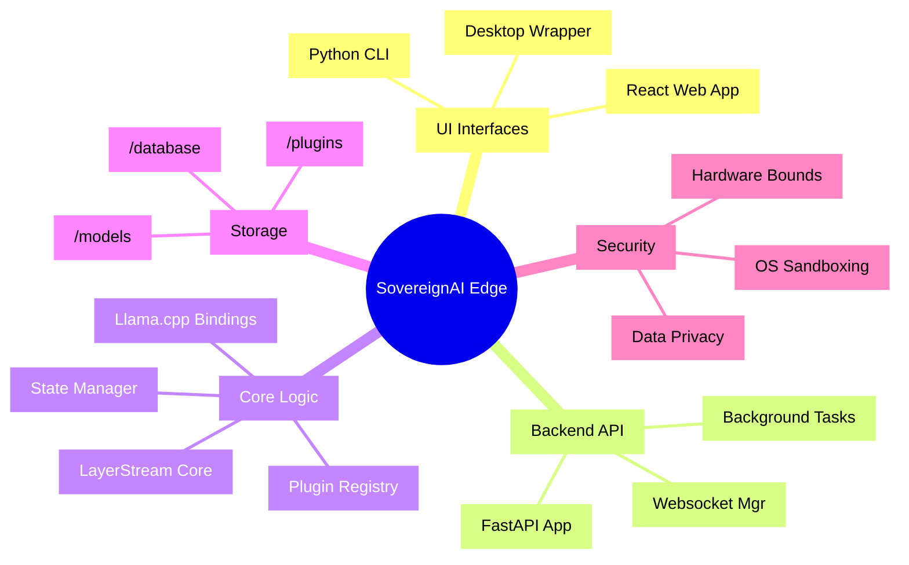

# Hierarchical Mindmap

## 1. Structural Overview
The mindmap details the vast scale and modular architecture of SovereignAI Edge. Because the platform acts as a monolith, mapping out its components visualizes responsibilities from the presentation layer down to OS-level tensor execution.

## 2. Detailed Mindmap Visual Structure

