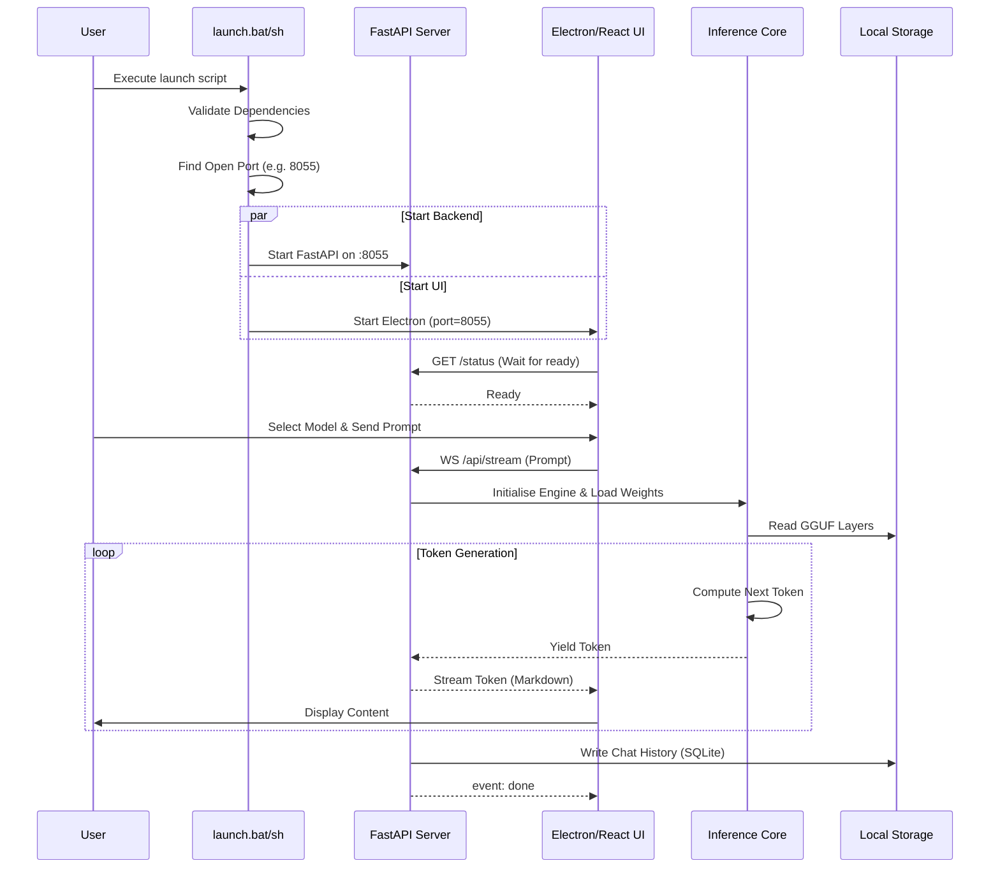

# Application Working Flow

## 1. Start-to-Finish Lifecycle
The timeline follows a cold-boot sequence up to serving complex AI generations via Electron or the Web UI.

## 2. Boot Sequence
1. **Trigger:** User double-clicks `launch.bat` (Windows) or `./launch.sh` (Linux/Mac).
2. **Environment Validation:** Scripts check if embedded Python or Node binaries exist.
3. **Paths Mapping:** Maps the current working directory to absolute variables for internal routing.
4. **Backend Boot:** Initiates FastAPI on a random open port between `8000` and `8080`.
5. **UI Boot:** The script passes the detected port to the Electron shell executable.

## 3. Active Session Flow
1. **Frontend Init:** React queries the backend at `GET /status` to verify hardware readiness and loaded models.
2. **Interaction:** The User selects "Llama-3" and types a message.
3. **State Change:** The React UI sets local state to `loading` and opens an SSE or WebSocket connection to `WS /api/stream`.
4. **Processing (Backend):** Python parses the input, loads Llama-3 (if not loaded), formats the prompt, and pipes it to the `cpp` layer.
5. **Streaming Response:** The model yields tokens one by one over WS.
6. **Frontend Update:** React concatenates tokens in real-time onto the DOM using Markdown parsing (react-markdown).
7. **Conclusion:** Backend sends `"event": "done"`. Frontend converts the rendered text to a permanent SQLite history entry.

## 4. Graceful Shutdown
Closure is critical to prevent database corruption.
- When the Electron window is closed, a SIGTERM is fired.
- The Backend halts any active inferences.
- Llama.cpp unmaps `.gguf` bindings (Freeing RAM).
- SQLite connections are cleanly closed.

## 5. Detailed Operational Diagram

