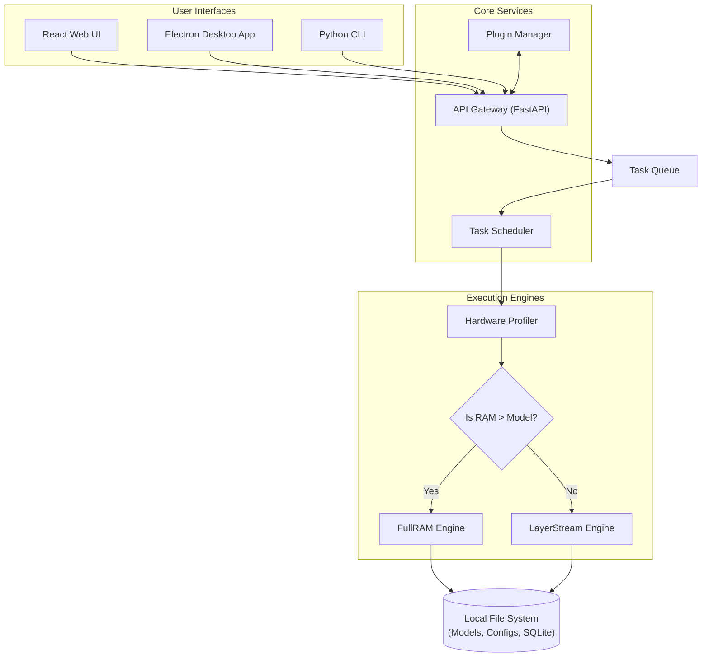

<!-- /autoplan restore point: git commit 6971a54 (docs committed + clean; restore with `git checkout -- PRD.md TRD.md`) -->

# Product Requirements Document (PRD)

## 1. Executive Summary
**SovereignAI Edge** is a fully portable, 100% offline Artificial Intelligence platform that empowers users to run large language models (LLMs) locally on consumer-grade hardware or directly from external drives (USB/SSD). It eliminates the need for cloud dependency, guaranteeing utmost data privacy, security, and accessibility in air-gapped environments.

## 2. Target Audience & Use Cases
- **Privacy-Conscious Individuals:** Users who do not want their prompts, data, or personal information sent to corporate cloud servers.
- **Enterprise & Defense (Air-gapped Environments):** Organizations dealing with highly classified information where internet connectivity is physically severed.
- **Researchers & Data Scientists:** Professionals requiring localized AI execution for testing and internal tooling without API costs.
- **Digital Nomads & Remote Workers:** Users in areas with poor or zero internet connectivity.

## 3. Comprehensive Feature List
### 3.1. Zero-Internet Operations
- **Fully Local Execution:** Everything, including the frontend UI, backend API, and inference engine, runs locally over `localhost`.
- **Pre-packaged Dependencies:** The installation payload includes all runtime requirements (Python binaries, Node.js packages) ensuring no `npm install` or `pip install` is needed at runtime.

### 3.2. Dual Execution Engines
- **FullRAM Engine:** For systems with high RAM/VRAM. Loads the entire model checkpoint into active memory for maximum tokens-per-second (t/s) speed.
- **LayerStream Engine:** A proprietary fallback engine for extremely low-memory systems. Iteratively loads and unloads individual neural network layers from NVMe/SSD to RAM, enabling 3-8B Q4 models on 8GB RAM (measured: 0.40 tok/s, 2.3GB peak RSS). Larger models run but slowly.

### 3.3. Cross-Platform & Portability
- **USB-Bootable Execution:** Can run entirely from a portable Flash Drive or External SSD without leaving registry keys or configuration files on the host OS.
- **Multi-OS Support:** Compatible with Windows, macOS (M-series & Intel), and Linux distributions.

### 3.4. Interfaces
- **Desktop Application:** A native-feeling Electron.js application for seamless daily usage.
- **Web UI:** A modern React.js interface accessible via browser on the local network (if exposed).
- **CLI (Command Line Interface):** A terminal-based interactive shell for power users, scripting, and headless server environments.

### 3.5. Extensibility
- **Plugin System:** Allows the injection of custom Python scripts to extend functionality (e.g., local RAG over documents, custom system prompts, localized web search simulation based on local archives).
- **Model Agnosticism:** Supports the GGUF model format natively, allowing users to drop in variants of Llama, Mistral, Gemma, etc.


## 4. Product System Context Visual



## 5. Security & Constraints
- **Data Retention:** Chat histories and configurations are saved locally via SQLite or flat JSON files.
- **Telemetry:** Strictly no telemetry, crash reporting sent to remote servers, or background internet pings.

---

# /autoplan Review Appendix (CEO + Design) — 2026-08-05

> Full-pipeline auto-review of the **whole repo state** (PRD/TRD/TODOS + actual code). Restore point: commit `6971a54`. Premise gate: **PASSED** (P1/P2 accepted as open risks). Final gate: **APPROVED as-is**. Voices: subagent-only (Codex unavailable on this machine).

## Decision Audit Trail

| # | Phase | Decision | Class | Principle | Rationale | Rejected |
|---|-------|----------|-------|-----------|----------|----------|
| 1 | CEO | Mode = SELECTIVE EXPANSION | Mechanical | P6 | Large existing codebase, not greenfield | Other modes |
| 2 | CEO | Challenge P1 (70B-on-8GB usable) | User Challenge | Research | Disk-swap IO math → sub-1 tok/s; MoE+Q4 is the real answer | Accept premise |
| 3 | CEO | Challenge P2 (custom engine over llama.cpp) | User Challenge | P5/P3 | llama.cpp already does mmap+offload; 3 duplicate engines proved the trap | Keep custom engine |
| 4 | CEO | Premise gate: validate first | User decision | — | User accepted both challenges | — |
| 5 | CEO | Defer marketplace/USB polish to TODOS | Auto | P2/P3 | Outside blast radius of core validation | Include now |
| 6 | CEO | Drop "patent LayerStream" | Auto | P4/P3 | Re-skin of llama.cpp mmap/swap; distraction | Keep |
| 7 | Design | Delete/disable speculative task UI modules | Auto | P5 | UI for features that don't work end-to-end | Keep |
| 8 | Design | 5-state chat lifecycle required | Auto | P1 | Complete edge coverage (no model/loading/ready/generating/error) | Happy-path only |
| 9 | Design | Stay dark-only (taste) | Taste | P3 | Light tokens exist; toggle is extra scope | Build toggle |
| 10 | Design | ModeSwitcher → user-facing labels (taste) | Taste | P5 | Speed mode vs Low-memory mode clarity | Technical labels |
| 11 | Eng | Delete ManualStream + orphaned helpers | Auto | P4 | Dead/duplicate, zero callers | Keep |
| 12 | Eng | Shrink task_router to 2 entries | Auto | P4 | 32 entries, 2 used; 30+ AutoModel imports at import time | Keep |
| 13 | Eng | Auth + path validation before LAN exposure | Auto | P1 | No auth anywhere; path traversal risk | Defer |
| 14 | Eng | Real engine tests, not factory fakes | Auto | P1 | 43 tests skip the riskiest paths | Fake-factory only |
| 15 | DX | `sovereign import <gguf>` offline flow | Auto | P1 | Offline product needs offline model acquisition | pull-only |
| 16 | DX | OpenAI-compat test + docs | Auto | P1 | Drop-in compat is the developer wedge | Unverified naming |
| 17 | DX | Reconcile 4 stale docs | Auto | P1 | Docs actively mislead onboarding | Leave |

## Phase 1 — CEO Review

### Premises (challenged → accepted as open risks)

| # | Premise | Verdict |
|---|---------|---------|
| P1 | LayerStream runs 70B+ on 8GB RAM at usable speed | 🔴 Critical, unvalidated → validation spike required |
| P2 | Custom PyTorch engine + GGUF parser is the right build | 🔴 Critical → stand on llama.cpp where possible |
| P3 | 100% offline is a differentiator | 🟡 Table stakes (Ollama/LM Studio/Jan all offline) |
| P4 | USB portability is a unique wedge | 🟡 Micro-segment; Portable-AI-USB already exists; "zero-install" contradicts multi-GB bundle |
| P5 | Air-gapped enterprise is addressable early | 🟡 Procurement/cert barriers; hyperscaler-owned |
| P6 | 3 UIs + plugins + RAG in parallel with engine | 🟠 Sequencing risk; ~1,800 lines dead code already |

### What already exists (leverage map)
Working: CLI + server auto-start (**43 passing tests** — AGENTS.md "empty suite" claim stale), FastAPI gateway, FullRAM via `transformers.AutoModelForCausalLM` (custom GGUF parser already removed), Next.js 16 UI with **first-run hardware recommendations built**, Electron (contextIsolation on, nodeIntegration off), FAISS RAG, plugin system, HF download, hardware profiler. Product ≈ 75% assembled; the missing piece is validation of the one headline claim.

### Dream state delta
`CURRENT: CLI works + 2 UIs + dead code + unvalidated 8GB claim` → `THIS PLAN: finish LayerStream, 3 UIs, USB packaging` → `12-MONTH IDEAL: ONE proven wedge (drop-in OpenAI-compatible offline server or air-gapped doc intelligence) with benchmarked memory economics, one polished interface, real tests, clean codebase`.

### Error & Rescue Registry

| Failure | Rescue |
|---------|--------|
| 70B-on-8GB fails speed bar | Pivot messaging to 3–8B Q4 SLM on 8GB; LayerStream honest expectations or drop claim |
| Custom GGUF parser bugs | Already replaced for FullRAM; finish by deleting remaining hand-rolled pieces |
| "Zero-install" breaks offline | Bundle wheels/venv in release; verify launch.bat offline path |
| Docs drift | Single source of truth; update PRD/TRD/CLAUDE/AGENTS to reality |

### CEO consensus table

```
  Dimension                           Claude  Codex  Consensus
  1. Premises valid?                 NO      N/A    CHALLENGE (P1/P2 critical)
  2. Right problem to solve?         NO      N/A    CHALLENGE (no wedge)
  3. Scope calibration correct?      NO      N/A    CHALLENGE (3 UIs premature)
  4. Alternatives explored?          NO      N/A    CHALLENGE (llama.cpp ignored)
  5. Competitive/market risks?       YES     N/A    CONFIRMED (Ollama/LM Studio duopoly)
  6. 6-month trajectory sound?       NO      N/A    CHALLENGE
```

### CEO Completion Summary
Strategic direction conditional: run the P1 validation spike (2–4 wks) before further engine/UI investment; pick a wedge; delete dead code (~1,800 lines, already catalogued); treat P3–P6 as positioning, not differentiators. All flagged issues resolved by 2026-08-05 final gate (approved as-is).

## Phase 2 — Design Review

### Litmus scorecard (7 dimensions)

| Dimension | Score | Key finding |
|-----------|-------|-------------|
| 1. Information hierarchy | 6/10 | Home page well-structured; 7 nav destinations over-chrome the core chat act |
| 2. Interaction states | 6/10 | Scroll/jump-pill high-craft; missing stop button, OOM error card, backend-offline state |
| 3. First-run / journey | 7/10 | Hardware recommendations + control panel BUILT (subagent corrected); not a full wizard |
| 4. Responsive strategy | 8/10 | md: breakpoint grids; no obvious breakage |
| 5. Accessibility | 6/10 | Radix baseline + reduced-motion respected in scroll anim; forced dark, verify contrast |
| 6. Specificity / identity | 5/10 | Brand tokens wired; mostly generic shadcn aesthetic (taste) |
| 7. Design-system alignment | 7/10 | Consistent shadcn discipline, token system correct for Tailwind v4 |

### Design consensus table

```
  Dimension                           Claude  Codex  Consensus
  1. Hierarchy serves user?          PARTIAL N/A    CHALLENGE (over-chromed)
  2. States specified?               PARTIAL N/A    CHALLENGE (5-state lifecycle missing)
  3. First-run specified?            YES     N/A    CONFIRMED (built)
  4. Distinctive identity?           NO      N/A    TASTE (defer to polish pass)
  5. Accessibility specified?        PARTIAL N/A    CHALLENGE (verify + fix)
  6. Dead-weight UI?                 YES     N/A    CONFIRMED (task/ modules)
```

### Design Completion Summary
Structurally sound UI with real polish in the chat surface; the 5-state chat lifecycle (no model / loading / ready / generating / error) and the speculative `components/task/` modules are the two highest-leverage design changes. Identity/motion deferred as taste.
