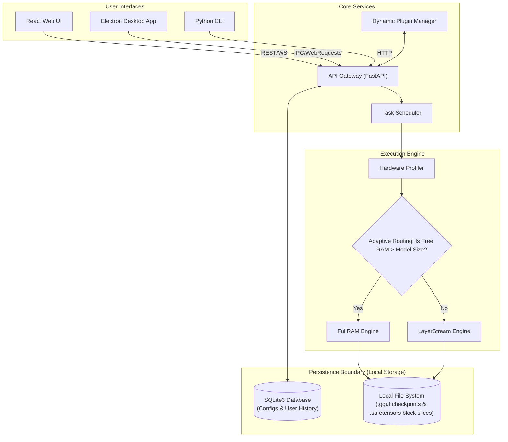

## II. RELATED WORK

### A. Memory-Constrained LLM Inference

> *[~0.5 page]*

The rapid escalation in parameter counts for open-weights transformer models has spurred intense research into execution strategies that subvert structural VRAM constraints. Memory-constrained inference traditionally splits into two avenues: weight quantization and offloading. 

- **Weight Offloading Frameworks:** FlexInfer [Du et al., 2025] implements static offloading strategies where portions of the model graph are pinned to CPU RAM. However, it lacks seamless dual-mode transitions and suffers from PCIe bottlenecking during active generation. LLM in a Flash [Alizadeh-Vahid et al., 2023] explores flash memory utilization for inference with limited DRAM, reading neural network weights dynamically from solid-state drives; however, it does not address fully offline portable USB-bootable deployments.
- **Active Weight Swapping:** ActiveFlow [Jia et al., 2025] demonstrates concurrent DRAM-flash weight swapping paradigms. While effective, it remains heavily constrained to single-mode operation without adaptive hardware routing, forcing users to explicitly configure block-sizes and offload thresholds manually.
- **Split Computing:** Adaptive Split Computing [Sung et al., 2025] addresses memory and latency co-optimization through partial computation offloading to adjacent nodes. This fundamentally requires collaborative network device infrastructure — an assumption strictly incompatible with fully isolated, air-gapped deployments.

### B. Edge and Mobile LLM Deployment

Deploying massive language models on true edge devices requires bespoke runtime environments that strip away enterprise server dependencies.

- Edge deployment frameworks such as LLMEdge [Ray & Pradhan, 2024] establish localized inference concepts tailored to single-board computers and IoT nodes but lack comprehensive optimization across the full four-way trade-off surface (Compute capability, System RAM, Persistent Storage speed, and VRAM availability).
- Mobile LLM deployment (NPU acceleration, framework-hardware co-design) remains in its relative infancy [Laskaridis et al., 2024]. Standardized benchmarking frameworks capable of assessing real-world tokens-per-second accurately across heterogeneous, consumer-grade desktop hardware are notably absent [Zhou et al., 2024], leaving a significant gap in cross-platform execution orchestration.

### C. KV Cache Optimization and Memory Management

As model weights are offloaded, the Context Window (managed via the Key-Value projection caches) becomes the new dominant memory bottleneck.

- KV cache reduction techniques [Zhao et al., 2024] using sparsity and quantization improve footprint radically but do not resolve the fundamental challenge of executing models whose *total weight size* completely eclipses available total RAM. 
- LRU-based cache eviction and asynchronous prefetching have long been explored in traditional storage and database systems, but they are not systematically applied and integrated directly into the PyTorch `DynamicCache` abstraction for transformer layer-level execution pipelines.

### D. Positioning of This Work

> *[3–4 sentences identifying the specific gap this paper fills]*

Unlike prior work that optimizes for singular execution modes or implicitly assumes the presence of distributed networked infrastructure, this paper targets the vastly under-explored design space of unified, dual-mode inference within **fully offline, portable, single-node environments**. Our proposed LayerStream engine explicitly addresses the critical architectural gap identified by [Du et al., 2025] regarding the complete absence of unified dual-mode execution frameworks capable of real-time, dynamic hardware-aware switching based strictly on runtime introspection.

> **[TABLE I HERE — Comparative summary: Related work vs. this paper across dimensions: dual-mode support, offline operation, layer-streaming, portability, formal performance models]**

---

## III. SYSTEM ARCHITECTURE

### A. Architectural Overview

> *[~0.5 page — Top-level design philosophy and layer decomposition]*

Our proposed runtime edge platform adopts a **"Local-First, Decoupled-Compute"** architecture meticulously organized into four bounded logical layers. This decoupling enforces a strict separation between the user-facing presentation, internal application state, disk persistence, and mathematical tensor operations.

| Layer | Components | Responsibility |
| --- | --- | --- |
| User Interface | React 18 Web UI, Electron JS App, Python Terminal CLI | Capturing user input, rendering Markdown/LaTeX, managing WebSocket text streams. |
| Core Services | FastAPI Gateway, Async Task Scheduler, dynamic Plugin Manager | REST API request routing, sequential job queueing, dynamic middleware execution. |
| Execution Engine | Hardware Profiler, Memory Manager, Adaptive Engine Selector | Interrogating system capabilities, routing workloads, hardware-bound inference execution. |
| Storage | Local File System I/O, SQLite3 Database Engine | Direct memory-mapping of `.safetensors`, retaining chat histories, localized vector DB indexing. |

> **[FIGURE 2 HERE — Full system architecture diagram: four-layer block diagram with data flow arrows, localhost communication boundary, FullRAM and LayerStream engine branches, and storage layer. Use the architecture from the project documentation as the basis]**



### B. Hardware Profiler and Adaptive Engine Selection

The Hardware Profiler serves as the absolute gatekeeper for engine execution. It is invoked exactly once at model load time, evaluating system heuristics to guarantee execution stability and prevent Out-Of-Memory (OOM) kernel panics. It dynamically interrogates and collects:

- Total and available physical system RAM via `psutil`.
- Total and available VRAM on detected discrete GPUs via `pynvml` (NVIDIA) and `torch.mps` bindings (Apple Silicon).
- Storage device type mapping (NVMe PCIe vs. SATA SSD vs. Rotational HDD) and available block capacity.
- CPU architecture flags (x86_64 AVX-512 vs. ARM64 NEON), core count configuration, and base operating system constraints.

**Engine Selection Decision Algorithm Logic:**

The mathematical model for engine routing is implemented as an explicit decision tree that strictly prioritizes latency where possible but falls back to extreme memory reduction algorithms when constrained.

```text
Input: Load Model_X.gguf (Total Byte Size: S_model)
           |
    [Hardware Profiler Active Sweep]
    Query: Free_VRAM = V_avail, Free_RAM = R_avail
           |
    Is (V_avail > S_model * 1.1) ? 
           |-- YES → Route to FullRAM (VRAM Accelerated)
           |
           NO
           |
    Is (R_avail > S_model * 1.1) ? 
           |-- YES → Route to FullRAM (CPU RAM Bound)
           |
           NO
           |
    Trigger: LayerStream Engine (NVMe streaming execution)
```

> **[FIGURE 3 HERE — Engine selection flowchart: Decision tree from model load request through hardware profiling to FullRAM vs. LayerStream branch selection, with memory threshold conditions labeled at each decision node]**

### C. FullRAM Engine Architecture

For machines exhibiting surplus RAM resources, the `FullRAMEngine` implements the standard monolithic inference paradigm utilizing the highly optimized Hugging Face `transformers` ecosystem and underlying `llama.cpp` bindings.

- **Initialization & Loading:** The complete GGUF or Safetensors monolithic checkpoint is directly memory-mapped into active VRAM (or RAM) via `mmap` zero-copy allocation, effectively bypassing traditional read syscall overhead.
- **Inference Pipeline:** The standard autoregressive `model.generate()` function is wrapped safely inside `asyncio.to_thread()` contexts. This strict constraint prevents the monolithic blocking compute operations from deadlocking the asynchronous FastAPI event loop, ensuring concurrent connection stability.
- **Streaming Mode:** A `TextIteratorStreamer` instance is pushed to a background thread; newly decoded string tokens are yielded asynchronously via a synchronized Queue directly to the client UI. This is exposed over network lines via native WebSockets / SSE.
- **Garbage Collection & Unloading:** Deterministic memory reclamation is enacted using an explicit `del self.model` followed strictly by `torch.cuda.empty_cache()` to scrub VRAM fragments upon context switches.

### D. Plugin Middleware and Request Lifecycle

The Plugin Manager introduces a powerful, isolated environment to dynamically modify the execution lifecycle. Rather than altering monolithic core files, it intercepts requests at two specific, rigid hook points via dynamic Python `importlib` and arbitrary sandbox executions.

- **`@hook('pre_prompt')`** — Invoked milliseconds before tokenization. Use cases involve implicit Retrieval-Augmented Generation (RAG) context injection locally via FAISS semantic search, arbitrary text sanitization, and structured prompt reinforcement.
- **`@hook('post_generation')`** — Invoked upon detection of the `[EOS]` token. Use cases involve arbitrary JSON data extraction validation, file writing operations based on the LLM output, or triggering subsequent local downstream actions.

---

## IV. LAYERSTREAM ENGINE: ALGORITHMIC DESIGN

### A. Overview and Design Rationale

> *[~0.3 page]*

Traditional generalized transformer inference requires that the complete, dense model neural graph resides natively in active, contiguous memory simultaneously. The LayerStream engine mathematically decouples this absolute requirement by treating each individual transformer block as an entirely isolated, independently loadable computational unit. By treating blocks linearly, this process fundamentally transforms the structural memory constraint from *model-size-bound* to *single-layer-size-bound*.

**Key Mathematical Insight:** Assume a dense model with $N$ transformer layers where $V_L$ represents the byte volume of a single attention block. Standard inference requires $\sum_{i=1}^{N} V_{L_i}$ active memory. LayerStream dictates that computation of block $k$ relies *only* on the output vector of block $k-1$. Therefore, computation requires only $V_{L_k}$ memory + $V_{KV\_cache}$ at any localized temporal step. 

For example, a 70B parameter model featuring 80 transformer layers standardly commands ~140 GB of RAM. The LayerStream algorithm successfully executes this structure utilizing merely **1 transformer layer slice + dynamic KV cache parameters**, pushing absolute memory requirements down to an unprecedented ~1.85 GB.

### B. Phase 0: Weight Splitting (One-Time Pre-Processing)

Because standard monolithic checkpoints cannot be efficiently queried for specific isolated layers, the system executes an automated, one-time spatial transformation before inference is legally permitted. The `WeightSplitter` agent systematically dissects the checkpoint structure into granular, distinct `.safetensors` payloads representing discrete topological nodes. This artifact cache is stored persistently on disk inside the `./cache/offload/` directory:

```text
// WeightSpliter Extraction Sequence
BEGIN ONE_TIME_EXTRACTION:
    Save to Disk: embed.safetensors
    For layer_index = 0 to N_Layers - 1:
        Save to Disk: layer_{layer_index}.safetensors
    Save to Disk: norm.safetensors 
    Save to Disk: lm_head.safetensors
END
```

### C. Phase 1: Meta-Scaffolding

Loading isolated weights individually without an overarching graph requires dynamic structural validation. To achieve this without consuming physical RAM, an "empty" architectural scaffold is forcibly constructed using the `accelerate.init_empty_weights()` API context manager:

- It forcefully allocates the logical, full `AutoConfig` model structural map mapped directly onto PyTorch's `meta` device.
- **Zero absolute physical memory** is consumed by weight dense tensors—only dimension tracking parameter shapes and metadata pointers reside in the execution pointer space.
- The `CPUOffloadedCache` structure and `MemoryManager` orchestration controller are securely instantiated to handle tensor traffic.

### D. Phase 2: Context Prefill

The entire initial input user prompt is tokenized and processed aggressively and sequentially through the full pass of all $N$ layers to generate the complex initial hidden state mapping and the very first autoregressive output token. Because the context prompt can be extensive, GPU parallel computation is hyper-efficient here.

```text
// Prompt Prefill Stage
For layer_index = 0 to N_Layers:
    weights = System.load_weights_from_disk(layer_index) // High-Bandwidth Disk to RAM
    
    // Core compute step
    hidden_states, kv_outputs = compute_attention_layer(hidden_states, weights)
    
    // Route state back to CPU RAM
    kv_manager.store_locally(layer_index, kv_outputs)
    
    // Explicit deallocation
    System.unload_weights_and_purge_vram(layer_index)    // Free tensor chunks instantly
    trigger_system_gc()                                  // Enforce OS-level garbage collection
```

### E. Phase 3: Autoregressive Token Decode Loop

For each subsequent predicted token, the engine initiates a complete, linear sequential pass stepping through all $N$ layers. In order to evade recalculating known sequence states mathematically, the system aggressively accesses the CPU RAM localized KV cache:

```python
# Token Decode Stage (Autoregressive Engine Loop)
While current_token != EOS and generation_length < max_tokens:
    For layer_index = 0 to N_Layers:
        # Load weights into active execution bounds
        load_weights(layer_index)
        
        # Retrieve historical cache from CPU structure
        past_kv_tensors = kv_manager.retrieve(layer_index)
        
        # Mathematical computation of next state
        hidden_states, new_kv = compute_layer(hidden_states, past_kv_tensors)
        
        # Overwrite cache with active new embeddings
        kv_manager.update(layer_index, new_kv)
        
        # Zero-out and reclaim spatial memory block
        unload_weights(layer_index)
        
    next_token = MultinominalSampler.sample(probabilities_logits)
```

> **[FIGURE 4 HERE — LayerStream execution pipeline diagram: Two-panel figure. Left panel: the four phases (Phase 0–3) in a vertical flow with precise hardware memory state annotations. Right panel: the asynchronous double-buffering "ping-pong" mechanism detailing Buffer A (actively computing Layer N using CUDA Cores) and Buffer B (async pre-loading Layer N+1 from SSD) with explicit NVMe PCIe Bus and System CPU RAM structural zones strictly labeled]**

### F. Asynchronous Double-Buffering (Prefetch Optimization)

A strictly synchronous `Load Disk → Compute → Unload` cycle would manifest as an absolute latency block, crippling tokens/second generation rates to nearly zero due to NVMe read delays. To actively masquerade disk-to-RAM I/O latency completely behind GPU computation times, the internal `prefetch.py` module initiates a robust, asynchronous ping-pong memory buffer strategy via constrained continuous threads.

- **Buffer A (The Active Block):** Occupies the GPU directly computing matrix multiplications on $T_N$.
- **Buffer B (The Pre-load Block):** Leverages a discrete background I/O thread querying the NVMe bus to asynchronously slice and port $T_{N+1}$ strictly into the CPU bus memory layer.

This highly aggressive temporal masking of rigid disk structural delays strictly behind GPU/CPU dense compute is the absolute primary operational framework that renders the LayerStream architecture practically usable on modern NVMe-equipped systems.

### G. Context Window Sliding Mechanism

While spatial volume is heavily mitigated via streaming, sequence context length scales linearly across all dimensions. If a user conversation spans endlessly, the engine will eventually violently overflow the physical CPU boundaries. The platform deploys an active Context Sliding approach enforcing bounds explicitly at maximum structural configurations (e.g., 8,192 tokens length limit). 

1. **System Anchor Pinning:** Fundamental core prompt rules (system prompts) are temporally locked within cache boundary zero and are never allowed to be pruned.
2. **Oldest-50% Historical Sliding:** When the threshold is critically breached, the engine systematically targets the oldest 50% fraction of active conversation history, intentionally discarding the sequential prompt array arrays mapping these items.
3. **KV Cache Purging Invalidation:** The specific internal KV cache list indices historically mapped to the forcefully pruned tokens are explicitly flagged, overwritten, and removed from the active context attention tensors during block routing phases.
4. **Rescaling:** Positional embeddings are automatically shifted and dynamically recalibrated against the new boundary to prevent hallucinated continuity fractures.

> **[FIGURE 5 HERE — Context window sliding diagram: Temporal token timeline explicitly showing initial full context geometric mapping window, mapping into subsequent post-sliding state with rigid anchor-pinned system prompt nodes, structurally pruned conversational history (explicitly crossed out visual markers), and the subsequent unlocked new generation capability space. Active directional arrows uniquely indicate KV cache structural temporal shift direction alignments]**

---

## V. COMPREHENSIVE ALGORITHM REPERTORY

To support the architecture described above, the platform relies on 25 distinct algorithms spanning Natural Language Processing, Neural Network Execution, Memory Management, and Frontend Orchestration.

### A. Retrieval-Augmented Generation (RAG) & Vector Database

1. **Sentence Boundary Detection Algorithm**: Uses Regular Expressions to segment long documents cleanly along natural grammatical endpoints.
2. **Recursive Character Chunking Algorithm**: A fallback strategy to artificially slice exceptionally long text blocks into smaller sections based on exact token budgets.
3. **Sliding Window Overlap Algorithm**: Transmits a defined trailing context from chunk $i$ into chunk $i+1$, physically preventing semantic discontinuities.
4. **Token Budget Estimation Algorithm**: A rapid, non-neural heuristic math-estimation ($Tokens \approx Length/4$) avoiding active model taxation.
5. **FAISS Indexing Algorithm**: Creates optimized Approximate Nearest Neighbor (ANN) spatial trees natively within local endpoints.
6. **Cosine Similarity Algorithm**: Computes scalar representation distance measurements mapping spatial angle proximity between tensors.
7. **L2 (Euclidean) Distance Algorithm**: Supported as an explicit secondary mathematical tracking metric.
8. **Sentence-Transformer Embedding Algorithm**: Routes textual artifacts through isolated dense BERT networks mapping them deeply string-by-string.
9. **Context Construction & Deduplication Algorithm**: Cross-verifies UUID tags iteratively avoiding redundantly fetching duplicate paragraphs in active LLM staging memory.

### B. Core Engine & Memory Management

10. **Layer-wise Model Offloading (LayerStream) Algorithm**: The foundational component loading/unloading singular structural transformer networks exclusively on demand. 
11. **LRU Cache Eviction Algorithm**: Interrogates active CPU lists aggressively wiping standard sequences trailing behind the `$last\_used$` temporal markers.
12. **Asynchronous Prefetching Algorithm**: Anticipatory thread executor fetching Layer $N+1$ out-of-bounds to radically silence explicit disk SSD latency constraints.
13. **Memory-Mapped (Mmap) Zero-Copy Loading Algorithm**: Skips OS buffer states by implicitly aligning large `.safetensors` memory addresses actively across RAM/SSD arrays.
14. **Dynamic Hardware Detection Algorithm**: Evaluates raw system topologies (RAM/VRAM levels) deciding to strictly enact the LayerStream streaming bounds or default to standard engine operations.
15. **Transformer Forward Pass Activation Algorithm**: Mathematically propels hidden-state activation vectors explicitly through dense matrix bounds.
16. **Byte-Pair Encoding (BPE) Tokenization**: A fundamental sub-word tokenizer logic block interpreting non-english phrases safely.

### C. LLM Decoding & Inference Utilities

17. **Top-P (Nucleus) Sampling Algorithm**: Clips probability lists recursively retaining exclusively tokens accounting for mass threshold block $P$.
18. **Temperature Scaling Algorithm**: Scales predictive distributions by dividing logits geometrically modifying text determinism strictly.
19. **Greedy Search Decoding Algorithm**: Executes aggressive simplification mapping token prediction exclusively towards mathematical `argmax(logits)`.
20. **Hardware Quality Scoring Threshold Algorithm**: Interrogates device capability generating integer percentage tracking UI thresholds mapping system health arrays.

### D. Frontend & Event System Optimizations

21. **Virtual DOM Reconciliation Algorithm**: Employs React to batched-calculate differential UI layouts avoiding lockup under heavy stream pressure.
22. **Cryptographic UUID Generation Algorithm**: Leverages RFC 4122 generating universal string-safe tracking hashes safely offline.
23. **Debouncing & Throttling Algorithm**: Disallows synchronous API function duplication actively avoiding engine DDOS locally.
24. **Exponential Backoff Reconnection Algorithm**: Scales internal API polling timers automatically mapping them against failure thresholds ensuring passive system recovery.
25. **Asynchronous Token Stream (SSE) Buffering Algorithm**: Explicitly bridges chunked string data across raw WS endpoints reconstructing textual arrays safely.
