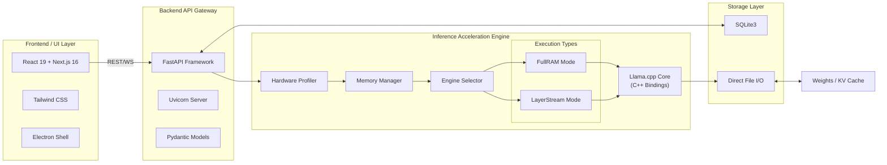

<!-- /autoplan restore point: git commit 6971a54 (docs committed + clean; restore with `git checkout -- PRD.md TRD.md`) -->

# Technical Requirements Document (TRD)

## 1. System Architecture Goals
The core objective of the **SovereignAI Edge** platform is to provide a zero-configuration, dependency-free execution environment. The technical stack must support dynamic hardware detection, efficient memory management, and cross-platform consistency.

## 2. Detailed Technical Stack
### 2.1 Backend / Inference Core
- **Language:** Python 3.10+ (Bundled as an embedded standalone executable via PyInstaller or similar to avoid host OS dependencies).
- **Core Frameworks:** 
  - FastAPI (for serving local REST / WebSocket API).
  - PyTorch + transformers (FullRAM engine via AutoModelForCausalLM; GGUF fallback via llama-cpp-python).
  - Pydantic (for strictly typed configurations and API models).
- **Database:** SQLite3 (Local, serverless, file-based database for chat history and plugin states).

### 2.2 Frontend / UI layer
- **Language/Framework:** Node.js 18+, React.js 19, TypeScript.
- **State Management:** Zustand for local state.
- **Styling:** Tailwind CSS v4 for responsive and portable styling.
- **Build Tool:** Next.js 16 (static export; no Vite).

### 2.3 Desktop Wrapper
- **Framework:** Electron.js.
- **Integration:** Intercepts frontend API calls and transparently manages the lifecycle (start/stop) of the enclosed Python backend binary.

## 3. Hardware & System Requirements
### 3.1 Minimum Specifications (LayerStream Mode)
- **CPU:** 4-core processor (x86_64 or ARM64).
- **RAM:** 8 GB DDR4.
- **Storage:** NVMe SSD heavily recommended (min 10GB free space for a 7B model).
- **GPU:** Integrated Graphics.

### 3.2 Recommended Specifications (FullRAM Mode)
- **CPU:** 8-core processor+
- **RAM:** 16 GB - 32 GB DDR5.
- **Storage:** NVMe SSD.
- **GPU:** Dedicated GPU with at least 8GB VRAM (NVIDIA RTX series or Apple Silicon Unified Memory).

## 4. Portability & File System Layout
Since the application runs off external drives, absolute paths cannot be used. Operations rely on relative paths resolved dynamically at runtime.
- `./models/` - Stores `.gguf` weight files.
- `./database/` - Stores SQLite data and user configs.
- `./plugins/` - User-added Python scripts.
- `./backend/` & `./frontend/` - Application binaries.


## 5. Technology Stack Visual Diagram


---

# /autoplan Review Appendix (Eng + DX) — 2026-08-05

> Full-pipeline auto-review of the **whole repo state**. Restore point: commit `6971a54`. Final gate: **APPROVED as-is**. Voices: subagent-only.

## Phase 3 — Eng Review

### Scope challenge (verified against code, not memory)
- Backend tests: **43 passed** in 30s (7 files: CLI auto-start, SSE, load status, fuzzy model match, split-auto mode, stream delta, think-strip). AGENTS.md "empty test suite" is stale.
- Frontend: **98 lines of TS errors** (`frontend/ts_errors_current.txt`) — `models/page.tsx` passes wrong props to `ModelTable`/`DownloadModal` (TS2769); `DownloadModal.tsx` duplicate imports (TS2300). **`npm run build` fails.**
- `task_router.py` (163 lines): 32-entry `TASK_CLASS_MAP`, 30+ AutoModel imports at import time, 3 `try/except` version shims; only `causal_lm` used by the product.
- `engine_factory.py:61`: DEBUG print in model-load path; factory couples creation + `load()`; still wires `ManualStreamEngine` (live trap — selectable, emits random tensors).
- `layerstream/`: `eviction.py` + `layer_by_layer_inference.py` already deleted, but orphaned helpers remain: `scheduler.py`, `prefetch.py`, `mmap_loader.py`, `introspection.py`, `splitter.py` (zero callers).
- 147 `print()` calls in `backend/app`; no structured logging. Electron baseline good (contextIsolation: true, nodeIntegration: false).
- Docs drift: TRD claims llama.cpp (reality transformers/PyTorch); CLAUDE.md claims SQLAlchemy (reality custom `DatabaseManager`).

### Architecture ASCII diagram

```
Client (React/Electron/CLI)
  └─ REST/WS :8000 ─▶ FastAPI gateway (/v1/*)
        ├─ api/chat.py ─▶ EngineFactory (core/engine_factory.py) ──┬─ FullRAMEngine   (transformers AutoModelForCausalLM)
        ├─ api/models.py ─▶ ModelManager (services/model_manager.py) └─ LayerStreamEngine (PyTorch layer-by-layer)
        │                      └─ MemoryManager.suggest_mode()            └─ [ManualStreamEngine — DELETE, live trap]
        ├─ core/task_router.py (32-entry map — shrink to 2) ── feeds FullRAM executor
        ├─ database/ (custom DatabaseManager + 7 table classes)
        ├─ plugins/ (sandbox.py — threat model unverified)
        ├─ vectorstore/ (FAISS RAG)
        └─ websocket/ (/metrics, unauthenticated)
```

### Eng consensus table

```
  Dimension                           Claude  Codex  Consensus
  1. Architecture sound?             NO      N/A    CHALLENGE (factory lifecycle, live trap, dead imports)
  2. Test coverage sufficient?       NO      N/A    CHALLENGE (fake factories, zero frontend tests)
  3. Performance risks addressed?    NO      N/A    CHALLENGE (to_thread w/o semaphore, DEBUG print in hot loop)
  4. Security threats covered?       NO      N/A    CHALLENGE (no auth, path traversal, sandbox unverified)
  5. Error paths handled?            NO      N/A    CHALLENGE (OOM/disconnect/disk-full unbuilt)
  6. Deployment risk manageable?     PARTIAL N/A    MIXED (Electron good; build broken)
```

### Key findings (auto-decided)
1. **F1 — EngineFactory couples create + load** (high): factory should return constructed engine; caller owns `load()` with error mapping. Fix accepted.
2. **F2 — ManualStreamEngine live trap** (high): delete import, branch, and `manualstream/`. Fix accepted.
3. **F3 — task_router import cost + dead map** (high): shrink to `{causal_lm, seq2seq_lm}` + `AutoModel` fallback; delete QA/vision/audio `execute()` branches. Fix accepted.
4. **F4 — Frontend build broken** (critical): 98 TS errors must be fixed before anything ships. Fix accepted.
5. **F5 — Error paths unbuilt** (high): OOM→507, client-disconnect cancellation (`Request.is_disconnected()`), disk-full preflight for LayerStream swap, concurrent-load lock. Fix accepted.
6. **F6 — No auth / path traversal** (high, conditional on exposure): token middleware when binding >localhost; assert paths under workspace root; reject `..` in model/upload/snapshot names. Fix accepted.
7. **F7 — Tests dodge the risk** (critical): 43 tests monkeypatch `EngineFactory`; add real-engine tests (LayerStream executor, `suggest_mode` boundaries, chat e2e with a tiny model), plugin sandbox, RAG, WS metrics, frontend. Fix accepted.
8. **F8 — Orphaned helpers** (medium): delete `scheduler.py`/`prefetch.py`/`mmap_loader.py`/`introspection.py`/`splitter.py` now (zero callers). Fix accepted.
9. **F9 — 147 print() calls** (medium): structured `logging` with levels + context. Fix accepted.

### Test diagram (codepath → coverage)

| Codepath | Covered by | Gap |
|----------|-----------|-----|
| CLI server auto-start | test_cli_chat_start / test_cli_sse | — |
| Model load orchestration | test_load_status_agree (fake factory) | Real engine load |
| SSE streaming | test_stream_delta / test_cli_sse | Disconnect cancellation |
| Think-token strip | test_think_strip | Through full API stack |
| Mode selection | test_split_auto_mode (fake) | Real `suggest_mode` boundaries |
| LayerStream executor | none | 🔴 Highest risk, zero coverage |
| Chat API e2e (real model) | none | 🔴 Add with tiny Q4 model |
| Plugin sandbox / RAG / WS metrics | none | Medium risk, no coverage |
| Frontend | none | 🔴 Build broken; no tests |

### Test plan artifact
1. Fix TS errors → `pnpm build` green (blocker).
2. e2e chat test: load tiny model (e.g. Qwen2.5-0.5B Q4) via real `EngineFactory`, stream 1 completion, assert token deltas + think-strip. (slow, tag `@slow`)
3. `suggest_mode` boundary unit tests: model == RAM, slightly under, GPU-offload thresholds.
4. LayerStream executor integration: swap correctness, KV cache persistence, eviction race guard (executor.py L147-151).
5. Auth middleware test (token required on >localhost), path traversal rejection tests.
6. OpenAI-compat contract test for `/v1/chat/completions` response shape.

### Failure Modes Registry

| Failure | Severity | Mitigation |
|---------|----------|-----------|
| OOM during load/generate | Critical | Typed 507 + mode suggestion (F5) |
| Concurrent model loads | High | Single-flight lock (F5) |
| Client disconnect mid-stream | High | is_disconnected hook + test (F5) |
| Disk full during swap | High | Preflight + write-failure handling (F5) |
| LAN exposure w/o auth | High | Token middleware (F6) |
| Path traversal via model/upload names | High | Root-relative path assert (F6) |
| Plugin sandbox escape | High | Audit sandbox.py threat model (F6) |
| Frontend ships broken | Critical | Fix 98 TS errors first (F4) |

### Eng Completion Summary
~70% assembled, good hygiene in spots (CLI tests, Electron baseline, frontend polish). Three blockers before shippable: frontend build, real engine tests, auth boundary. Dead-code deletions are low-risk and should land first.

## Phase 3.5 — DX Review

### Developer journey map (9 stages)

| Stage | Current | Issue |
|-------|---------|-------|
| 1. Discover | README pitch: "zero-config, no pip install" | Contradicted by installer |
| 2. Install | `install.sh` clones GitHub + pip torch (multi-GB) | Needs internet; not one-shot |
| 3. First run | `launch.bat` venv + deps bootstrap | Minutes of setup |
| 4. Get a model | `sovereign pull` via huggingface_hub | Needs internet — offline product |
| 5. Run | `sovereign run` / UI | Works (43 tests on CLI) |
| 6. Integrate | `/v1/chat/completions` | OpenAI compat unverified |
| 7. Debug | 147 print()s, no error catalog | Cause/fix invisible |
| 8. Extend | Plugin system | Docs thin |
| 9. Upgrade | `main` branch clone | No releases, no migration notes |

### DX consensus table + scorecard

```
  Dimension                           Claude  Codex  Consensus
  1. Getting started < 5 min?         NO      N/A    CHALLENGE (~45 min reality)
  2. API/CLI naming guessable?        PARTIAL N/A    MIXED (CLI fine; API compat unproven)
  3. Error messages actionable?       NO      N/A    CHALLENGE (prints, no catalog)
  4. Docs findable & complete?        NO      N/A    CHALLENGE (4 stale docs mislead)
  5. Upgrade path safe?               NO      N/A    CHALLENGE (clones main, no tags)
  6. Dev environment friction-free?   NO      N/A    CHALLENGE (multi-GB, internet required)
```

| Dimension | Score |
|-----------|-------|
| Getting started | 3/10 |
| API/CLI ergonomics | 6/10 |
| Error messages | 3/10 |
| Documentation | 3/10 |
| Upgrade path | 3/10 |
| Dev environment | 4/10 |
| Escape hatches / config | 5/10 |
| First-run / onboarding | 3/10 |
| **Overall** | **3.75/10** |

### DX Implementation Checklist
1. Ship a real artifact (PyInstaller bundle or prebuilt venv/wheels) — honest one-shot install.
2. `sovereign import <path.gguf>` as first-class offline flow; headline in docs.
3. OpenAI-compat contract test + documented `base_url`/supported params.
4. Structured logging + error reference (code → cause → fix): insufficient RAM, disk full, corrupt GGUF, port in use.
5. Reconcile 4 stale docs (AGENTS/CLAUDE/PRD/TRD); verified Quickstart run in CI.
6. Tag releases; pin install to latest tag; migration notes.
7. Surface config knobs (port, bind, model dir) as env vars / `sovereign config`.

### TTHW assessment
Current: **~45 min** (install Python + clone + pip torch + pull model). Target: **<10 min** (network, bundled artifact) / **<5 min** (offline, pre-downloaded bundle). Ollama benchmark: ~2 min.

### DX Completion Summary
Weakest phase. The "drop-in local OpenAI" promise is unproven, offline promise contradicted by installer + model acquisition, docs waste a newcomer's first hour. All fixes are cheap relative to engine work.

