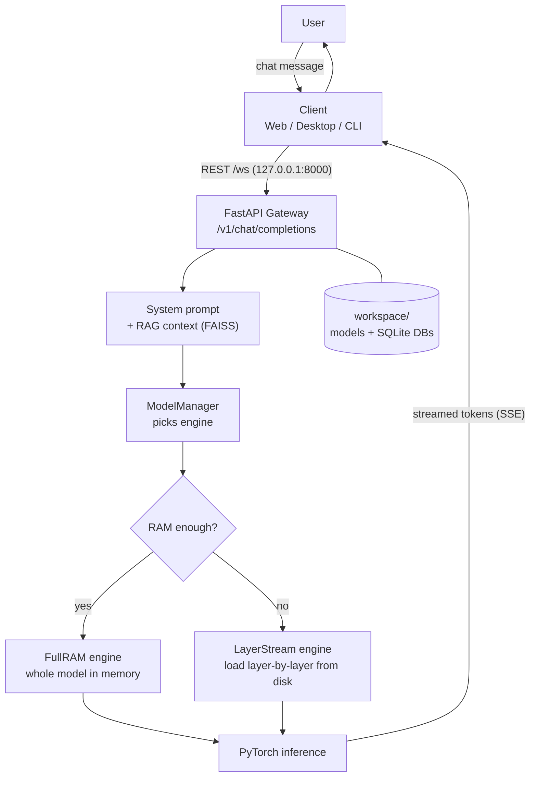

# SovereignAI — Data / User Flow

Simple flow for slides. Paste into <https://mermaid.live> or a Mermaid PPT plugin to render.

```mermaid
flowchart TD
    A[User] -->|chat message| B["Client<br/>Web / Desktop / CLI"]
    B -->|"REST /ws (127.0.0.1:8000)"| C["FastAPI Gateway<br/>/v1/chat/completions"]
    C --> D["System prompt<br/>+ RAG context (FAISS)"]
    D --> E["ModelManager<br/>picks engine"]
    E --> F{"RAM enough?"}
    F -->|yes| G["FullRAM engine<br/>whole model in memory"]
    F -->|no| H["LayerStream engine<br/>load layer-by-layer from disk"]
    G --> I["PyTorch inference"]
    H --> I
    I -->|"streamed tokens (SSE)"| B
    B --> A
    C --- S[("workspace/<br/>models + SQLite DBs")]
```
