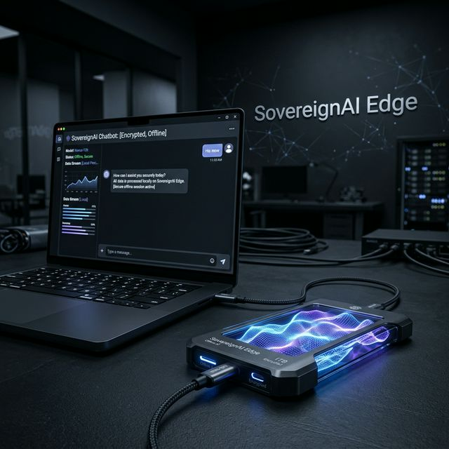
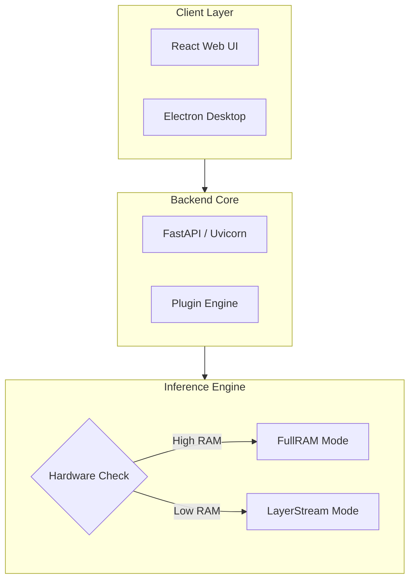
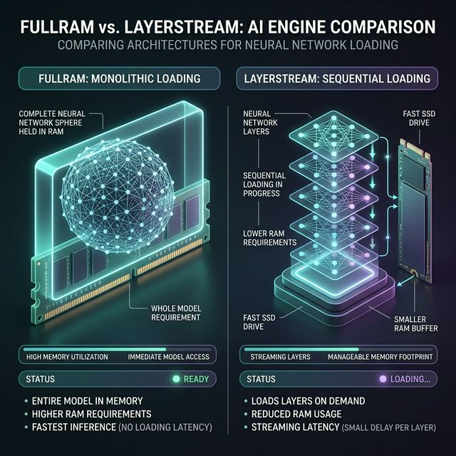

# 🛡️ SovereignAI Edge



> **The Ultimate Portable, 100% Offline AI Platform.**  
> Run large language models (LLMs) locally on consumer-grade hardware or directly from external drives (USB/SSD). No cloud, no telemetry, no compromise.

---
---
---
## 🚀 Key Features

| Feature | Description |
| :--- | :--- |
| **Dual Engines** | **FullRAM** for blazing speed, **LayerStream** for low-memory systems (8GB+). |
| **Fully Offline** | Operates in total isolation. No internet dependency after initial setup. |
| **Portable** | Zero-configuration execution from any NVMe/SSD or Flash drive. |
| **Extensible** | Powerful Python-based **Plugin System** for custom logic and RAG. |
| **Interfaces** | Choose between a modern **React Web UI**, **Electron Desktop App**, or **CLI**. |

---

## 🛠️ System Architecture

SovereignAI Edge is built with a decoupled micro-layer architecture for maximum portability and performance.



---

## ⚡ Performance: The Dual-Engine Advantage



### 1. FullRAM Engine
Loads the entire model checkpoint into active memory. Best for systems with high VRAM/RAM (e.g., NVIDIA RTX series, Apple Silicon).

### 2. LayerStream Engine
A proprietary fallback engine that iteratively loads and unloads individual neural network layers from Disk to RAM. Enables 70B+ parameter models on machines with as little as **8GB of RAM**.

---

## 📦 File System Layout

```text
SovereignAI/
├── 📁 backend/       # FastAPI & Inference Logic
├── 📁 frontend/      # React & Vite Source
├── 📁 electron/      # Desktop Wrapper
├── 📁 models/        # Place your .gguf models here
├── 📁 plugins/       # Custom Python plugins
└── 📁 database/      # SQLite History & User Configs
```

---

## 🏁 Quick Start

### Prerequisites
- Python 3.10+
- Node.js 18+
- 8GB+ RAM (Recommended)

### Execution
1. **Clone the repository**
2. **Launch the platform:**
   - **Windows:** Run `launch.bat`
   - **Linux/macOS:** Run `./launch.sh`

---

## 🛡️ Privacy First


SovereignAI Edge ensures that **zero bytes** leave your local machine. All prompts, documents, and chat histories are stored in your local encrypted SQLite instance.

---

<p align="center">
  Built with ❤️ for the Open Source AI Community.
</p>