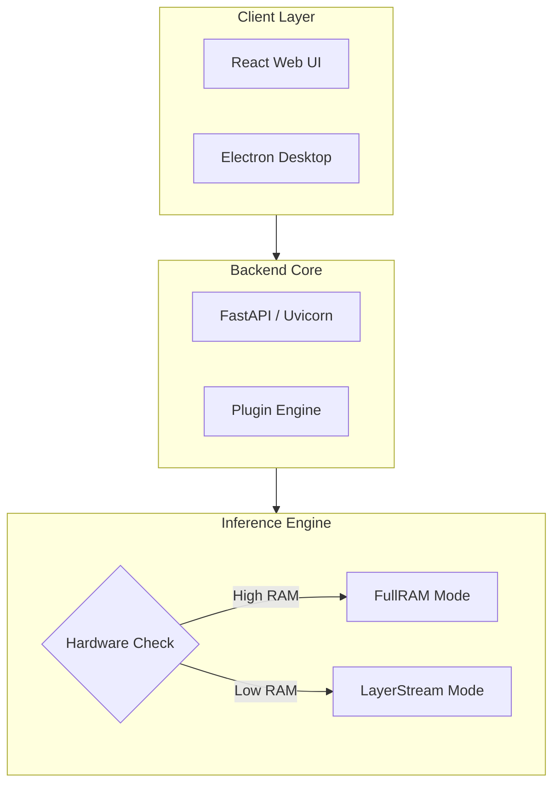

# 🛡️ SovereignAI Edge


> **The Ultimate Portable, 100% Offline AI Platform.**  
> Run large language models (LLMs) locally on consumer-grade hardware or directly from external drives (USB/SSD). No cloud, no telemetry, no compromise.

---

## 🚀 Key Features

| Feature | Description |
| :--- | :--- |
| **Dual Engines** | **FullRAM** for blazing speed, **LayerStream** for low-memory systems (8GB+). |
| **Fully Offline** | Operates in total isolation. No internet dependency after initial setup. |
| **Portable** | Zero-configuration execution from any NVMe/SSD or Flash drive. |
| **Extensible** | Powerful Python-based **Plugin System** for custom logic and RAG. |
| **Interfaces** | Choose between a modern **React Web UI**, **Electron Desktop App**, or **CLI**. |

---

## 🛠️ System Architecture

SovereignAI Edge is built with a decoupled micro-layer architecture for maximum portability and performance.



---

## ⚡ Performance: The Dual-Engine Advantage


### 1. FullRAM Engine
Loads the entire model checkpoint into active memory. Best for systems with high VRAM/RAM (e.g., NVIDIA RTX series, Apple Silicon).

### 2. LayerStream Engine
A fallback engine that iteratively loads and unloads individual neural network layers from Disk to RAM, so models larger than free RAM still run. Sweet spot: **3-8B Q4 models on 8GB RAM** (measured: 1.9GB model → 2.3GB peak RSS). Large models (70B+) run but slowly — see [reviews/benchmark-2026-08-14.md](reviews/benchmark-2026-08-14.md) for honest numbers.

---

## 📦 File System Layout

```text
SovereignAI/
├── 📁 backend/       # FastAPI & Inference Logic (Python 3.10+, PyTorch/transformers)
├── 📁 frontend/      # Next.js 16 + React 19 (static export, no Vite)
├── 📁 electron/      # Desktop Wrapper
├── 📁 models/        # Place your .gguf models here
├── 📁 plugins/       # Custom Python plugins
└── 📁 database/      # SQLite History & User Configs
```

---

## 🏁 Quick Start

### Prerequisites
- Python 3.10+
- Node.js 18+
- 8GB+ RAM (Recommended)

### Execution
1. **Clone the repository**
2. **Launch the platform:**
   - **Windows:** Run `launch.bat`
   - **Linux/macOS:** Run `./launch.sh`

---

## 🛡️ Privacy First


SovereignAI Edge ensures that **zero bytes** leave your local machine. All prompts, documents, and chat histories are stored in your local encrypted SQLite instance.

---

## 🔌 OpenAI-Compatible API

`POST http://127.0.0.1:8000/v1/chat/completions` is a drop-in OpenAI
`/chat/completions` endpoint — any OpenAI SDK/client works by pointing
`base_url` at it (no API key needed on localhost).

**Supported request params:** `messages`, `model`, `max_tokens`, `temperature`,
`top_p`, `stream`, `use_rag`, `enable_thinking`.

**Extension:** thinking-mode models stream reasoning in
`choices[0].delta.reasoning` alongside `content`; standard OpenAI clients
ignore the extra key. Shapes are pinned by
`backend/tests/test_openai_compat.py`.

---

<p align="center">
  Built with ❤️ for the Open Source AI Community.
</p>
