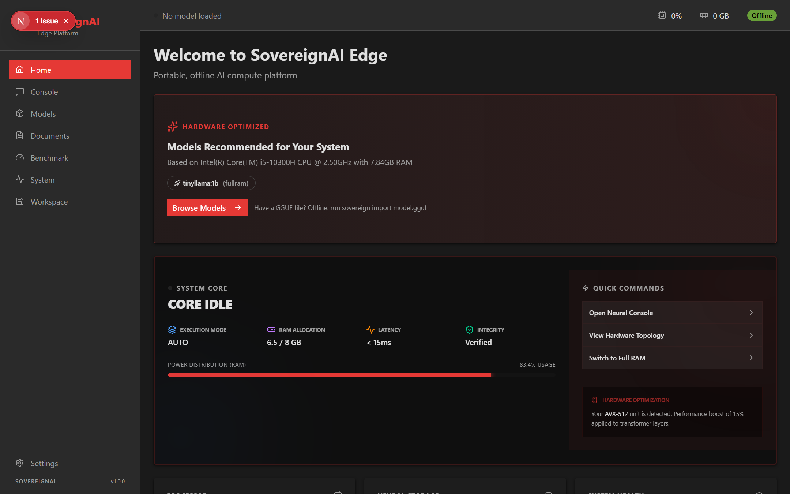
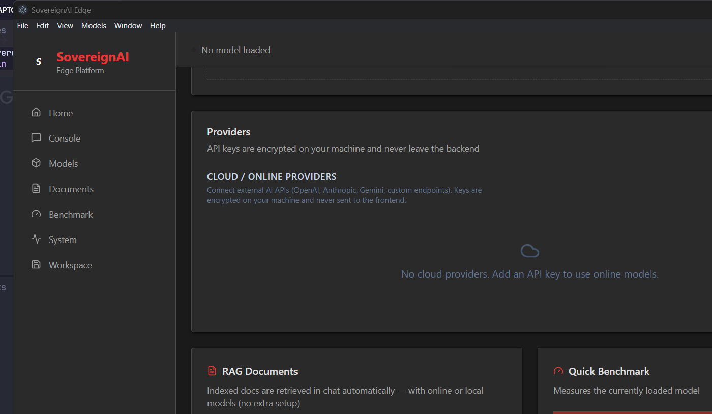

<div align="center">

# 🛡️ SovereignAI Edge

**The Ultimate Portable, 100% Offline AI Platform.**

Run large language models locally on consumer hardware or directly from USB — no cloud, no telemetry, no compromise.

[](LICENSE)
[](https://www.python.org/)
[](https://nextjs.org/)
[](https://pytorch.org/)
[](https://github.com/SovereignAI/Edge/stargazers)
[](https://github.com/SovereignAI/Edge/issues)

---

**[Quick Start](#-quick-start)** · **[Architecture](#%EF%B8%8F-system-architecture)** · **[Performance](#-performance-the-dual-engine-advantage)** · **[API](#-openai-compatible-api)** · **[Contributing](#-contributing)**


---

</div>

## ✨ Key Features

<table>
<tr>
<td width="50%">

### 🧠 Dual Inference Engines
**FullRAM** loads entire models for blazing speed. **LayerStream** swaps layers from disk — run 3–8B models on just 8GB RAM.

</td>
<td width="50%">

### 🔒 100% Offline & Private
Zero data leaves your machine. All prompts, documents, and history stay in local encrypted SQLite. No telemetry.

</td>
</tr>
<tr>
<td>

### 📦 Portable
Zero-config execution from any USB/SSD. All paths relative — just clone and run.

</td>
<td>

### 🖥️ Three Interfaces
Modern **React Web UI**, **Electron Desktop App**, or powerful **CLI** — pick your workflow.

</td>
</tr>
</table>

---

## 🏗️ System Architecture

```
┌─────────────────────────────────────────────────┐
│                 Client Layer                     │
│  ┌──────────────┐  ┌────────────────────────┐   │
│  │  React Web   │  │  Electron Desktop App  │   │
│  │  (Next.js)   │  │  (Chromium wrapper)    │   │
│  └──────┬───────┘  └──────────┬─────────────┘   │
│         └──────────┬──────────┘                  │
│                    │ REST / WebSocket             │
├────────────────────┼─────────────────────────────┤
│               Backend Core                       │
│  ┌─────────────────┴──────────────────────┐      │
│  │         FastAPI Gateway (/v1/*)         │      │
│  │  Chat · Models · RAG · Benchmark       │      │
│  └─────────────────┬──────────────────────┘      │
│                    │                             │
│  ┌─────────────────┴──────────────────────┐      │
│  │       Engine Selection (auto mode)      │      │
│  │   Hardware profile → llmfit scoring     │      │
│  └──────┬──────────────────────┬──────────┘      │
│         │                      │                 │
│  ┌──────▼──────┐      ┌───────▼────────┐        │
│  │  FullRAM    │      │  LayerStream   │        │
│  │  (PyTorch + │      │  (raw PyTorch  │        │
│  │transformers)│      │  layer-by-layer│        │
│  └─────────────┘      └────────────────┘        │
│                                                  │
│  ┌──────────────────────────────────────┐        │
│  │   Storage: workspace/{models,db,...}  │        │
│  └──────────────────────────────────────┘        │
└──────────────────────────────────────────────────┘
```

### Data Flow

1. **Client** sends chat/message via REST or WebSocket to `127.0.0.1:8000`
2. **FastAPI Gateway** injects system prompt, optional RAG context, and applies chat template
3. **Engine** generates or streams tokens (SSE batching at ~96 chars/frame)
4. **Response** returned as OpenAI-compatible JSON or Server-Sent Events

---

## ⚡ Performance: The Dual-Engine Advantage

### FullRAM Engine
Loads the entire model into active memory. Best for systems with high VRAM/RAM (NVIDIA RTX, Apple Silicon). Uses `transformers.AutoModelForCausalLM` with GGUF fallback via `llama-cpp-python`.

### LayerStream Engine
Iteratively loads/unloads individual neural network layers from disk to RAM. Enables models larger than free RAM to still run. Sweet spot: **3–8B Q4 models on 8GB RAM**.

> ⚠️ Large models (70B+) run but slowly. See [reviews/benchmark-2026-08-14.md](reviews/benchmark-2026-08-14.md) for honest numbers.


### Benchmarks

| Model | Engine | Tokens/sec | Notes |
|:------|:-------|:-----------|:------|
| Qwen2-0.5B (int4) | FullRAM | 0.85 | Fast path |
| Qwen2-0.5B (int4) | LayerStream | 8.0 | Post device-cache fix |
| Qwen3.5-0.8B (int4) | LayerStream | 0.48 | Bounded by missing `causal-conv1d` kernels |

---

## 📁 File System Layout

```
SovereignAI/
├── backend/          # FastAPI + Inference (Python 3.10+, PyTorch, transformers)
├── frontend/         # Next.js 16 + React 19 (static export)
├── electron/         # Desktop wrapper (Electron 28)
├── workspace/        # Runtime data root
│   ├── models/       # Model checkpoints (.gguf, .safetensors)
│   ├── database/     # SQLite (sovereign.db + sovereign_settings.db)
│   ├── offload_cache/# LayerStream per-layer chunks
│   ├── sessions/     # Chat snapshots
│   ├── vectors/      # FAISS vector index
│   └── plugins/      # User Python plugins
└── Info_docs/        # Obsidian wiki (31 pages)
```

---

## 🖥️ Interface Previews

<table>
<tr>
<td align="center" width="33%">

**React Web UI**

<!-- Replace with: screenshot of the web chat console at localhost:3000 -->


*Chat · Models · Settings*

</td>
<td align="center" width="33%">

**Electron Desktop**

<!-- Replace with: screenshot of the Electron app window -->


*Native desktop experience*

</td>
<td align="center" width="33%">

**CLI**

```bash
$ sovereign chat
> Hello, how are you?
╭ assistant
│ I'm doing well, thanks for asking!...
╰─
```

*Terminal-native workflow*

</td>
</tr>
</table>

> 📸 **Contributors:** Replace the placeholder images above with actual screenshots.
> Capture `web-ui-preview.png` and `electron-preview.png` into `Info_docs/assets/`.

---

## 🏁 Quick Start

### Prerequisites

- **Python** 3.10+
- **Node.js** 18+
- **RAM** 8GB+ recommended

### Option A: One-Click Launch

```bash
# Windows
launch.bat

# Linux / macOS
./launch.sh
```

### Option B: Manual Setup

```bash
# 1. Clone the repo
git clone https://github.com/SovereignAI/Edge.git
cd Edge

# 2. Backend
cd backend
pip install -r requirements.txt
python main.py

# 3. Frontend (new terminal)
cd frontend
npm ci
npm run dev

# 4. Electron Desktop (optional, new terminal)
cd electron
npm ci
npm start
```

### Option C: CLI

```bash
cd backend/app
python -m cli.main --help

# Chat with a loaded model
python -m cli.main chat

# Pull a model from HuggingFace
python -m cli.main pull Qwen/Qwen2-0.5B
```

---

## 🔌 OpenAI-Compatible API

SovereignAI Edge exposes a drop-in OpenAI `/chat/completions` endpoint:

```bash
curl http://127.0.0.1:8000/v1/chat/completions \
  -H "Content-Type: application/json" \
  -d '{
    "messages": [{"role": "user", "content": "Hello!"}],
    "stream": true
  }'
```

**Supported params:** `messages`, `model`, `max_tokens`, `temperature`, `top_p`, `stream`, `use_rag`, `enable_thinking`

**Thinking mode:** Models that support it stream `<think>` reasoning in `choices[0].delta.reasoning` alongside `content`. Standard OpenAI clients ignore the extra key — shapes pinned by `backend/tests/test_openai_compat.py`.

Point any OpenAI SDK at `base_url=http://127.0.0.1:8000` — no API key needed on localhost.

---

## ⚠️ Known Limitations

| Area | Status |
|:-----|:-------|
| **LayerStream speed** | Sub-1 tok/s on CPU for large models. GPU blocked on Windows (no `causal-conv1d` wheel). |
| **TurboQuant** | Parked. Default-off. 4/4 eval gates failed. See `reviews/eval_gate_*.json`. |
| **FullRAM on low RAM** | Requires enough RAM for the entire model. Use `mode=auto` for automatic engine selection. |
| **Model formats** | Primary: safetensors (transformers). GGUF fallback via llama-cpp-python. BitNet IQ2_BN via ik-llama-cpp-python. |

---

## 🧪 Testing

```bash
# Fast tests (~25-50s)
cd backend && python -m pytest -m "not slow"

# Full tests (includes real-engine round-trip)
cd backend && python -m pytest

# Frontend
cd frontend && node --test lib/maskedLm.test.ts
```

**98 tests** across 13 files covering CLI, SSE streaming, think-strip, fuzzy model match, plugin sandbox, and OpenAI compat.

---

## 🛡️ Privacy First


SovereignAI Edge ensures that **zero bytes** leave your local machine. All prompts, documents, and chat histories are stored in your local encrypted SQLite instance.

---

## 🤝 Contributing

1. Fork the repo
2. Create a feature branch (`git checkout -b feat/amazing-feature`)
3. Run tests (`python -m pytest -m "not slow"`)
4. Submit a PR

See [AGENTS.md](AGENTS.md) for architecture details and code conventions.

---

## 📄 License

[MIT](LICENSE) — Built with ❤️ for the Open Source AI Community.

<div align="center">

**[⬆ Back to top](#-sovereignai-edge)**

</div>
